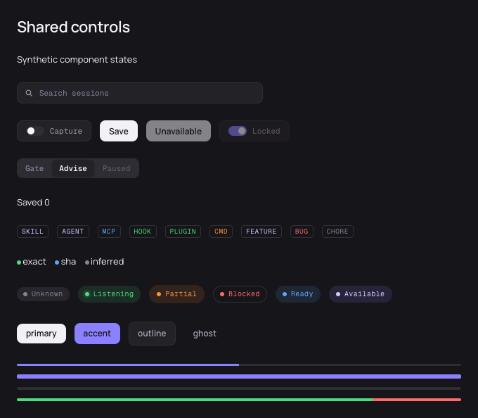
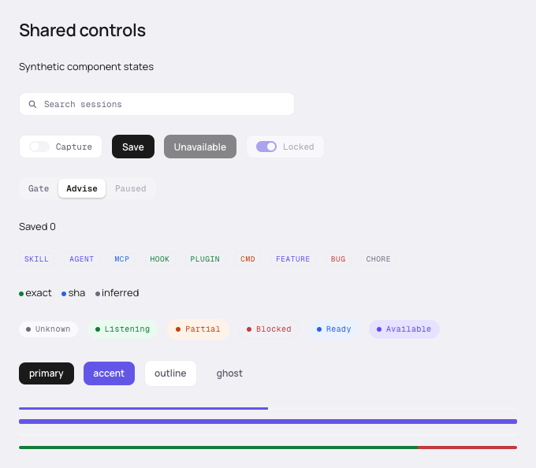

# FND-07b acceptance

Status: controlled primitives verified locally; real macOS 14/Safari 17 floor
acceptance remains pending. Plan slot: FND-07b.

| Setup/action                                                                           | Expected result                                                                                                                       | Evidence                                                           |
| -------------------------------------------------------------------------------------- | ------------------------------------------------------------------------------------------------------------------------------------- | ------------------------------------------------------------------ |
| Controlled switch/radios with disabled choices; Tab, Space, Enter, arrows and rerender | Enabled controls are reachable; callbacks fire once; state comes from props; disabled options never activate                          | Component cases plus real WebKit keyboard sequence pass            |
| All badge/evidence/live variants in both themes                                        | Explicit labels, semantic token colors and pulse only when live; reduced motion removes animation                                     | Component assertions and two synthetic captures pass               |
| Negative, zero, oversized, missing and nonfinite progress; huge finite segment sums    | Percentages stay within 0..100, unknown stays unmeasured, proportions remain finite and screen-reader text distinguishes equal totals | Component boundary cases pass, including Number.MAX_VALUE segments |
| Named Search input/ref with controlled text                                            | Focus reaches the actual input; typing reports value without hidden global shortcut behavior                                          | Unit and WebKit cases pass                                         |
| Shared compact layout and native-control interaction                                   | Contracted heights, white knob, no region overflow; disabled controls skipped by ordinary Tab                                         | WebKit geometry/keyboard assertions and visual review pass         |

`pnpm check` passes: 24 Vitest tests (ten focused control cases) and one Node lint
regression, plus types, lint and formatting. `pnpm build` passes. The focused
WebKit scenario passes and captures both themes with reduced motion and loaded
local fonts. WebKit 26.6 on the available host is not a substitute for the
macOS 14/Safari 17 native floor run.

The independent source review found two issues, both fixed and retested:
Button/Toggle require explicit Tab reachability under macOS WebKit, and segmented
progress requires an accessible per-part breakdown. No general metric or data
layer is introduced. Technical geometry is documented in [CONTROLS.md](../CONTROLS.md);
no unavailable design-export parity is claimed.

The focused browser check also passes with Playwright 1.58.2, which retains macOS 14 WebKit support. Reduced-motion emulation is supplied through `contextOptions` for that runner, and the scenario verifies the media query before checking the stopped animation. Retained captures were made with the initial 1.63.0 runner.
