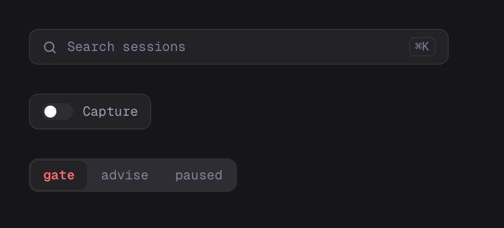
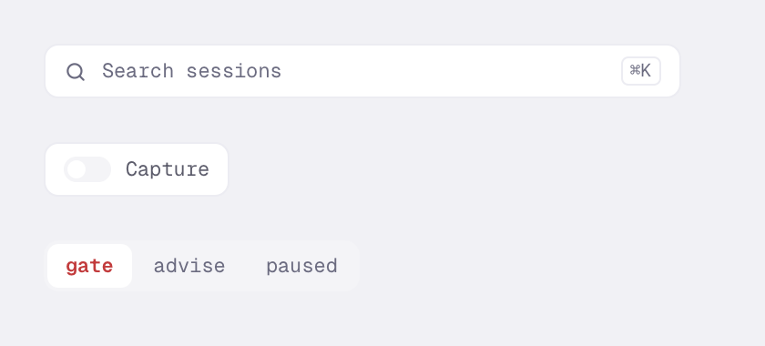
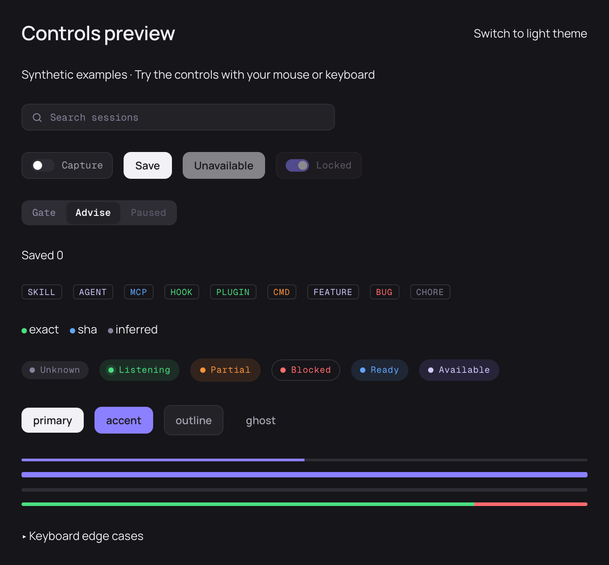
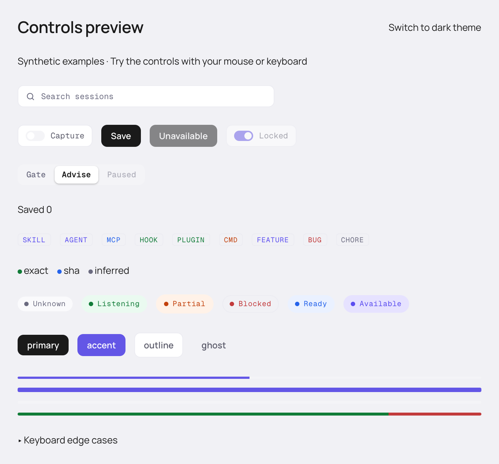

# Controls acceptance

This slice provides reusable controls and a working browser preview. It does not
wire new screens into the installed app. All captured data is synthetic.

| Setup/action                                                                          | Expected result                                                                                                                                                              | Verification                                          |
| ------------------------------------------------------------------------------------- | ---------------------------------------------------------------------------------------------------------------------------------------------------------------------------- | ----------------------------------------------------- |
| Tab, Space, Enter, and arrows through controlled switches, buttons, and a radio group | Enabled actions are reachable and fire once; disabled controls are skipped; state remains controlled by props                                                                | Unit cases and both browser engines                   |
| Hold the selected value; then disable, remove, and restore that choice                | Arrow focus can move without changing the held selection; unavailable selection is cleared visually and an enabled Tab entry remains; no change callback from rerender alone | Unit cases and browser keyboard edge cases            |
| All badge/evidence variants and explicit live/non-live pills                          | Text or accessible labels convey meaning; only live pulses; reduced motion stops animation                                                                                   | Unit labels plus browser CSS checks and visual review |
| Negative, zero, oversized, null, nonfinite, and huge finite progress                  | Measured values stay within 0–100; missing stays unmeasured; finite segment proportions do not overflow; accessible text distinguishes equal-total compositions              | Numeric boundary cases and browser semantics          |
| Focus and type into the Search input                                                  | Accessible label and forwarded ref reach the real input; callback reports text; no unwired shortcut hint                                                                     | Unit and browser interaction                          |
| Both themes, component sizes, and a 360px preview pane                                | Contracted dimensions, fixed white thumb, working theme switch, and no horizontal overflow                                                                                   | Chromium/WebKit geometry checks and reviewed captures |

## Validation

`pnpm check` passes: 51 UI tests and one lint regression, plus typechecking,
lint, and formatting. `pnpm e2e` passes all 34 Chromium/WebKit cases, including
six control scenarios. The production UI build passes.
Native debug launch validation runs on the available Mac. The macOS 14 release
floor, signing, notarization, and downloadable release validation remain separate
release checkpoints.

## Design comparison

The two reference images below render isolated search, switch, and segmented
fragments from the design source with its original theme CSS and bundled fonts.
Only generic labels and switch-state bindings were substituted. Reference renders
use no implementation CSS. The source search's shortcut hint is shown; the real
preview omits it because it has no global search action yet.

The implementation adds actual input/button semantics, focus rings, disabled
states, and the shared selected-segment shadow. It uses title-case option labels
and an initially selected Advise example; the reference shows lowercase Gate.
These are component-state comparisons, not screenshots of a finished page.
The badge/button/progress variants also retain their documented size and semantic
token contracts; the isolated reference does not claim page-level parity for them.

